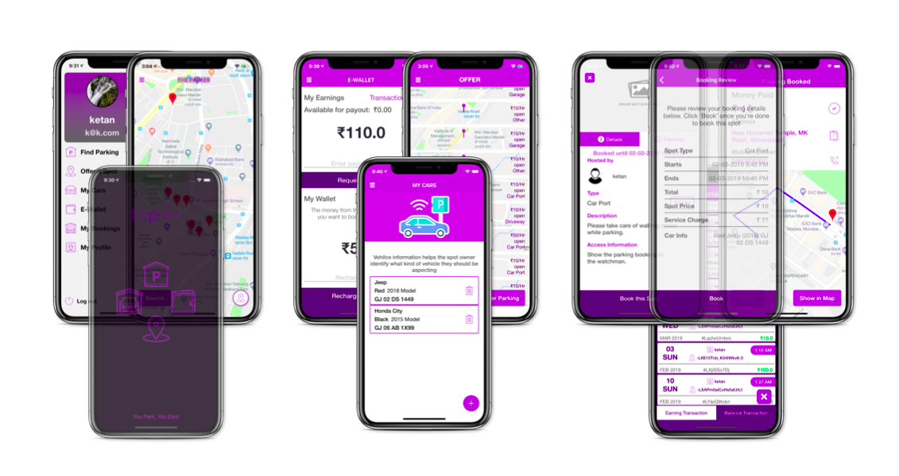

# Theparker: A shared parking app for extra income!

### Theparker is first open source shared parking app!

Theparker is the app build for iOS using Swift 4.2 and an Android version will be soon made open source.

It uses Firebase Realtime Database and Firebase Storage.(Currently it uses static payment, nom payment gateway is added)  

## FeatureS:

- [ ] Login using Google.
- [ ] Login Using mobile Number.
- [x] Upload Your parking Spot
- [x] Search Parking Space.
- [x] Login Using Email.
- [x] Check previous transactions.
- [x] Add my Cars.
- [x] Book Parking.
- [ ] Upload parking Photos.
- [x] Get direction to the parking spot.
- [x] Call the spot owner.
- [x] See previous parking Spot Added.
- [x] Check previous Booking.
- [x] Local Notification.
- [ ] Profile.

## Screenshots

 

